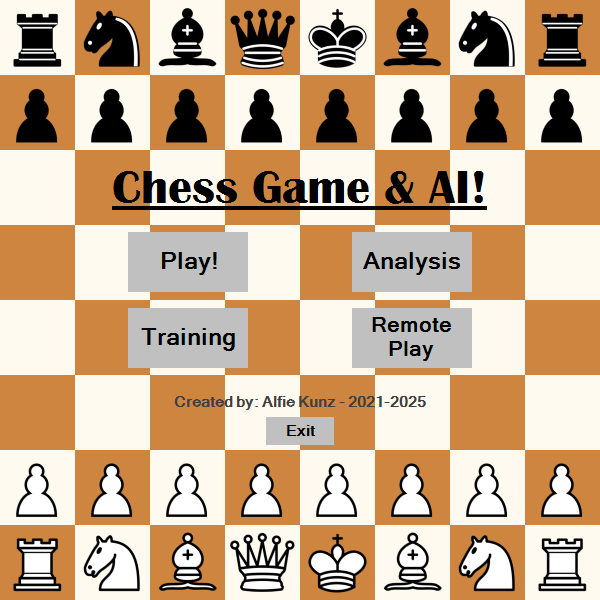
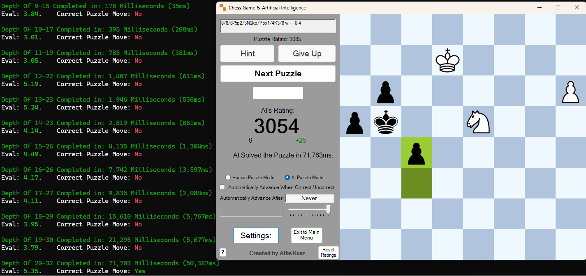
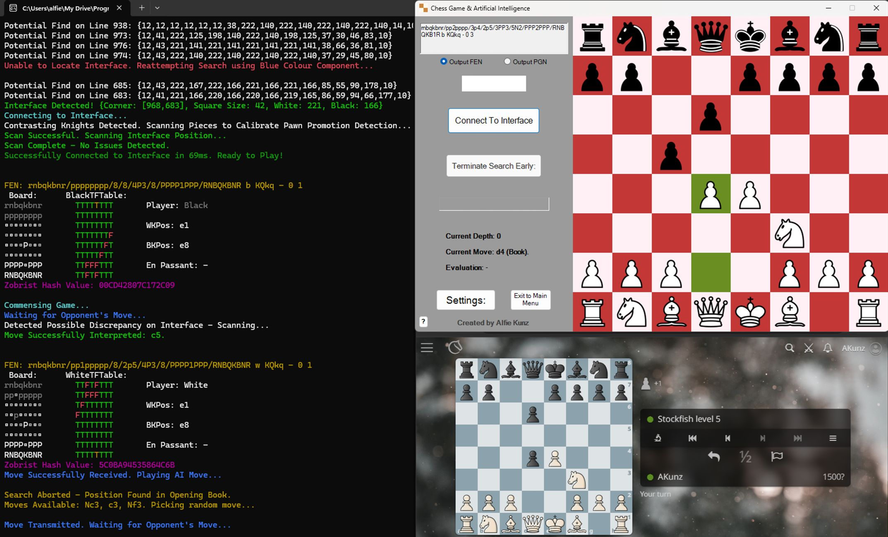
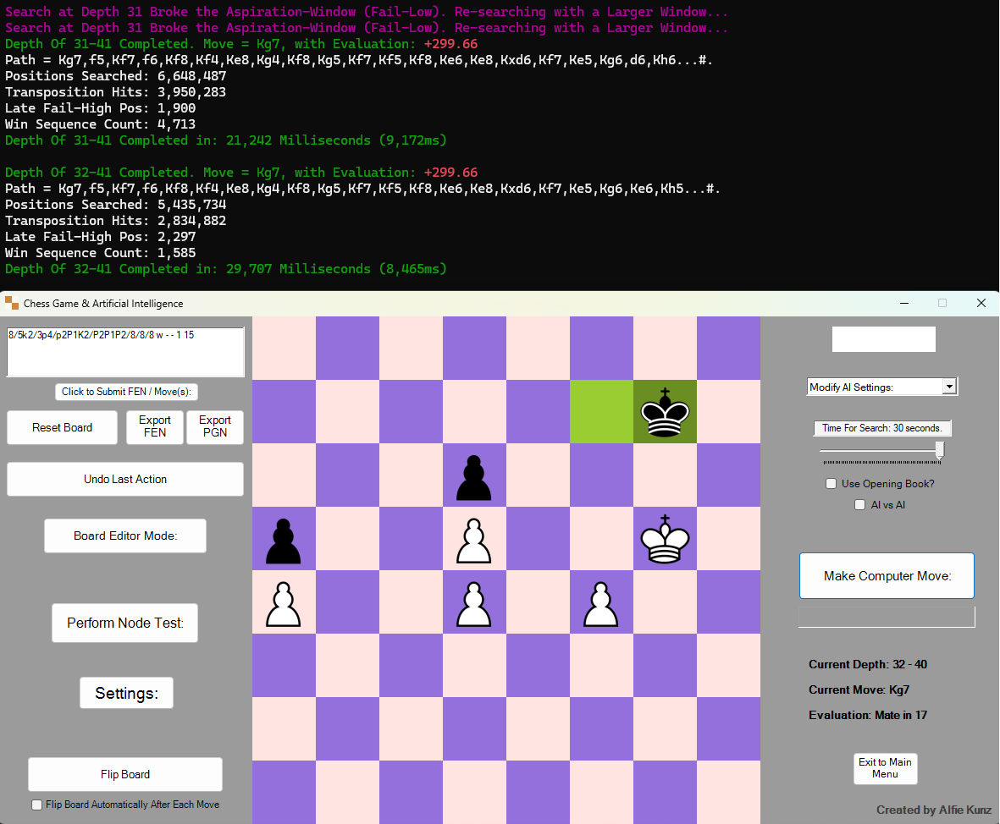
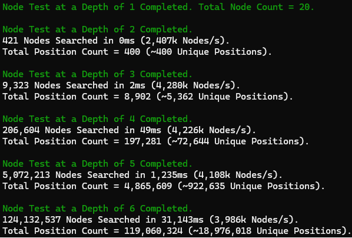

# Chess Game & Artificial Intelligence


-%23E10098.svg?style=for-the-badge)

---

v10.0 of my commercial-quality **Chess AI Project**, originally for my A-Level Computer Science NEA (on which my supervisor said it was the "best he had ever seen" in his years of teaching), on which I was awarded 100%. This features a strong Artificial Intelligence (built upon a highly-optimised, original NegaMax algorithm), created around a sophisticated chess-playing interface, packed to the brim with classic and original ideas.
> **Online Rating:** ~2850 ELO (Lichess).  
**Puzzle Rating:** ~3125 ELO (hand-crafted).

This work is self-motivated and self-funded, and is written primarily in VB.NET as a Visual Studio WinForms application.

<p align="center">
  
</p>

---

## Features and Highlights

### Interface, Controls & Game Experience
✅ Drag & drop, and click & move functionality for pieces.  
✅ Allows for inputting of positions (FEN) or moves in the current position (PGN move, full Lichess game, etc), dynamically choosing between them, and heavily robust validation & parsing (eg: estimating missing data). Invalid inputs flagged as such, with descriptive error messages.  
✅ Board highlights for legal-move highlighting, previous moves, and check highlighting.  
✅ Piece animations (move making) and board animations (morphing between positionsL uses bespoke greedy neighbour matching algorithm).  
✅ Ability to flip the board for each player's perspective (+ auto-flipping support).  
✅ Colourful, intuitive board GUI that adapts dramatically to each game mode. Displays extra information such as live search timings (with the updating AI current move info).  
✅ Animated boot sequence on the main menu.  
✅ In-depth, interactable settings form, for controls such as board colour scheme, piece animation speed, toggling highlights, fixed-depth AI searching, 'blindfold' mode, touch-move, etc. Settings persist across sessions, with robust fallback support.  
✅ Full range of sounds for each move, startup, training mode responces, and game termination.  
✅ Credits panel, displaying persisted lifetime AI statistics.  


### AI Engine Features
✅ Fully covers the legal moves of chess, including castling, moves in check, and choice of promotion.  
✅ Optimised Move Generation, via heavily optimised Bitboards and BitMoves, precomputed lookup tables, and pins / checks / king moves integrated directly into pseudo-legal generation, through a novel method I call 'TFTables'.  
✅ Large, hand-crafted Opening Book, built from millions of high-level games, with weighted-random move selection so more common, well-tested moves are favoured.  
✅ NegaMax search backbone, with Alpha-Beta Pruning.  
✅ Principal Variation Search (PVS).  
✅ Iterative Deepening, with adaptive starting depth based on the current position details.  
✅ Quiescence Search.  
✅ Delta Pruning.  
✅ Transposition Table via Zobrist Hashing ('deep' replacement scheme with TTL attribute): retained across searches and moves.  
✅ Advanced draw detection: threefold repetition (correct with or without the Transposition Table enabled) and the 50-move rule, integrated directly into both the AI's search tree and the UI game state.  
✅ Search Extensions, and Late Move Reductions.  
✅ Internal Iterative Reductions (IIR).  
✅ Null Move Pruning, with narrow StandPat windows and adaptable Zugzwang detection.  
✅ Dynamic Aspiration Windows.  
✅ Detailed search diagnostics: node counts, leaf-node counts, and position-collision tracking.  
✅ Extensively tuned, tiered move-ordering system (with an advanced system for the base position), using techniques such as MVV-LVA, Killer Moves, Transposition-Table-aware ordering, trades vs. open captures, near-promotions, moves closing in on the enemy king, moves giving check, contested squares (especially by enemy pawns), and static exchange evaluation.  
✅ Sophisticated pre-computed-driven evaluation function, involving hashed material count lookup, hand-crafted (aggressive) PieceHeatMaps (that adapt to the game phase and adjust 'on the fly' as pieces are traded), pawn bitboards (for quick identification of passed, isolated, or doubled pawns), king endgame heuristic (encourages well-knonw mating patterns and hindering opposing king movement).  
✅ Realistic AI search time mode, that mimics human-like behaviours when playing online: adapts to the complexity of the position, number of forced moves, pre-moves and book-moves, the AI's previous search information (eg: a recently broken aspiration window), win sequences found, and the estimated strength of the opponent.  


### Game Modes
✅ One-Player Mode: play against the AI at a range of pre-coded strengths and behavioural styles.  
✅ Two-Player Mode: local PvP, with customisable starting positions.  
✅ Analysis Mode: a sandbox for inputting, studying, and extracting full sequences of moves, returning detailed computer analysis (evaluation, best-path, and deep node testing), and in-depth adjustment of AI strength & search time. Also contains extra features such as 'endless AI' mode, board editor (for quick editing of the position, by freely dragging pieces around or spawning new pieces, with robust illegal placement detection), and perft-style node testing.  
✅ Puzzle Mode: solve (or give the AI to solve) over 2 million rated positions (with an 'extra hard' set). Live AI evaluation, and an optional timed 'puzzle rush' mode. Individually tracked ELO rating system (using exponential rating change weighted by puzzle rating) that persist over time.   
✅ Training Modes: Coordinate or Move time-based drills, for square-recognition or algebraic-notation recall against random legal moves in random positions. Persistent leaderboards for each side.  
✅ Remote Mode: locates any external chess interface (eg: lichess, chess.com) visible on the screen via computer-vision screen-reading (no matter the size, position, theme, or monitor), and connects to it by mapping all the squares and pieces to its internal structure. From here, the interface continuously tracks all moves made on the interface, then allows either to the user or the AI to make their response (on my chess GUI), which is then made on the external interface by controlling the mouse. Well-handled for poor data: error tolerances, quick & deep hybrid row scans, greyscale colour switching for locating the external board, estimating promotion pieces based on available data, remote and user move verification, etc. Purpose-built for benchmarking the AI's real-world strength against other engines, on sites such as Lichess.  


### Quality of Life, and Code Profiling
✅ Colourful, information-dense console window containing board states, live AI search and move information, colour-coded evaluation, and debug information for each game mode.  
✅ Custom cursor states (macOS-style "open hand") on sliders and pieces for drag & drop.  
✅ Support for undo-ing moves, and copying or exporting of current FEN / PGN.  

✅ Lazy-loaded database entries: only key information of puzzle & opening book entries are parsed on boot-up, with full detail computed on demand. The user can also choose a smaller opening book, if preferred.  
✅ Adaptive, dynamic program title reflecting the current game state.  
✅ Correct handling of multi-monitor setups and High-DPI displays.  
✅ External tool compatibility: creation of novel tools and controls for the optimisation of this project, such as a Version Comparer to allow different AIs to compete against each other, or the hand-picked opening book.  
✅ Grounded in code profiling and managing garbage collection: latency tuning, live Transposition Table memory management, and handling of deep searches.  
✅ Use of multithreading to allow both GUI control and AI searching.  

---

## Project Showcase

> **Project Demo:** You can see this project live directly through the [**v10.0 release**](https://drive.google.com/open?id=1sIJN5SI466Z6pHWhx42FbaHb7Ml4dm82) (Intel 32/64-bit). Simply click the 'Download All' button in the link attached, unzip and run the "Chess AI.exe" application. All instructions of use are provided throughout.

Alternatively, one can download the source code, as instructed below, for full control.

> This project was originally developed as my A-level Computer Science NEA project (which uses v5.2): you can access the <a href="https://www.alfiekunz.co.uk/academia/assets/projects/ProjectChess/Alfie%20Kunz%20Computer%20Science%20NEA%20Project%20Report.pdf" target="_blank" rel="noopener noreferrer">**original report here**</a>, or <a href="https://www.alfiekunz.co.uk/academia/assets/projects/ProjectChess/Previous%20AI%20Search%20Efficiency%20Tracking%20(Plotted%20-%2027.12.24).pdf" target="_blank" rel="noopener noreferrer">**track my AI's searching speed**</a> for all versions before v10.0.

<table align="center" width="100%">
  <tr>
    <td align="center" valign="middle" width="50%">
        <p align="center"><b>AI Puzzle Showcase</b></p>
        
    </td>
    <td align="center" valign="middle" width="50%">
      <p align="center"><b>AI Remote Mode Showcase (Lichess)</b></p>
      
    </td>
  </tr>
  <tr>
    <td align="center" valign="middle">
      <p align="center"><b>AI Finding Checkmate in 35 Moves</b></p>
      
    </td>
    <td align="center" valign="middle">
      <p align="center"><b>AI Starting Position Perft Test</b></p>
      
    </td>
  </tr>
</table>

---

## Technical Details

Chess averages ~35 legal moves per position; searching 10 moves deep yields no more than 35^10 ≈ 2.7×10^15 positions!! To have any hope of writing a chess engine, we are forced to walk down one of two paths: reinforcement-learning based AIs (such as AlphaZero), or deterministic, tree-search AIs (such as MiniMax). As the former can produce "blind spots" in practice for unknown scenarios, we traverse the latter...

The **MiniMax** algorithm provides a robust, "play-safe" foundation: by assuming 'perfect' play from the opponent, the algorithm guarantees mathematically optimal decisions within its search depth: we effectively *minimise* the *maximum* evaluation of all our opponent's responces to a given move, by emplyoying a depth-first search on the current position. Henceforth, a strong chess engine can be broken down into one which searches through positions quickly and efficiently, and one that can effectively evaluate the leaf nodes of our tree.

Once a branch is proven no better than an already-found alternative, there is no need to explore it deeper: we can 'prune' the search early, saving *lots* of time. This forms the basis of Alpha-Beta Pruning. As a result, it is desired to search the moves in some position from 'best to worse'; all these weaker moves can be pruned very quickly, from our previously calculated strong score. This incentivises many algorithms for sorting the available moves, before sorting them. Advanced techniques like Null Move Pruning and Delta Pruning further compress the search tree aggressively, allowing the AI to reach significantly higher depths in identical time controls.

To correctly evaluate a board position, we keep track of its details down the tree (hence motivating the use of storing the board, its pieces, and its data in efficient 'bit' form). From this, we can use the piece material, the activity of each piece, what phase of the game we are in, how likely pawns are to promote, king safety, etc to judge the strength of a given position for each player.

For effective move generation (amongst numerous optimisation practices), we introduce a novel technique I call 'TFTables'. This contains an 8x8 lookup table which stores the 'mobility' of each piece. This involves restricting pinned pieces, the movement of the king, and check handling and resolution. For more information on its intricacies, and how it interacts with the MiniMax algorithm, see the <a href="https://www.alfiekunz.co.uk/academia/assets/projects/ProjectChess/Alfie%20Kunz%20Computer%20Science%20NEA%20Project%20Report.pdf#page=27" target="_blank" rel="noopener noreferrer">**original NEA report**</a>.

---

## Installation, and Folder Structure

### Required Software: Visual Studio (.NET 8.0).

To install, simply clone this repository using the following terminal prompts.
```bash
git clone https://github.com/AlfieKunz/Chess-Game-AI
cd Chess-Game-AI
```
Alternatively, you can download the latest version source code (or an old one!) as a zip through the 'Releases' tab. Simply unzip the folder and open the "Chess AI.sln" file in Visual Studio.

Feel free to also fork this repository, open an issue, or submit pull requests. All contributions welcome! :)  
To better navigate this project, please see below for the related folder structure.

```
Chess AI                                                              
├─ Chess AI                                                           
│  ├─ AI.vb                                             // Main Chess AI code, built about the NegaMax algorithm with Alpha-Beta Pruning, and interactions with the main chess environment
│  ├─ AILookupTables.vb                                 // List of PieceHeatMaps, Endgame Lookup table, and pawn bonus tables
│  ├─ bin                                               //
│  │  └─ Debug                                          //
│  │     └─ net8.0-windows                              //
│  │        ├─ Assets                                   //
│  │        │  ├─ Chess960 FENs.txt                     // List of all possible Chess960 starting positions.
│  │        │  ├─ Images                                // Pictures of each chess piece, with room for extra themes
│  │        │  ├─ LargeOpeningBook.txt                  // A bespoke list of over 530,000 opening chess positions, and their expert-recommended moves
│  │        │  ├─ Puzzle Database                       // List of over 2 million puzzle FENs (and their moves), sorted by rating into 8 equal buckets (only 1 loaded per session to save time), and a small set of the highest-rated puzzles 
│  │        │  ├─ RandomFENs.txt                        // 10,000 chess positions taken from random online games, for use in Move Training mode.
│  │        │  ├─ SmallOpeningBook.txt                  // A small list of ~21,000 expert-level chess opening chess positions, and future moves (for fast loading times)
│  │        │  ├─ Sounds                                // Chess sound effects, taken from Lichess and Chess.com
│  │        │  └─ User                                  //
│  │        │     ├─ AIStats.txt                        // Number of AI nodes searched, transpositions found, and checkmates made
│  │        │     ├─ CoordinatePracticeLeaderboardB.txt // Leaderboard for the Coordinate Training mode (black side)
│  │        │     ├─ CoordinatePracticeLeaderboardW.txt // ditto for the white side
│  │        │     ├─ MovePracticeLeaderboardB.txt       // Leaderboard for the Move Training mode (black side)
│  │        │     ├─ MovePracticeLeaderboardW.txt       // ditto for the white side
│  │        │     ├─ PuzzleStats.txt                    // User and AI puzzle rating
│  │        │     └─ UserProfile.txt                    // User custom settings: colour scheme, animation speed, general options
│  │        └─ Chess AI.exe                             // Main application
│  ├─ Chess.Designer.vb                                 // WinForms design for the main chess program form
│  ├─ Chess.vb                                          // Main form for the core chess UI, and the basic game of chess: the rules of chess, importing / exporting positions & moves, manipulating the board, instantiating the AI class and translating its and user moves
│  ├─ Chess_AIHandles.vb                                // Class for allowing AI interactions with the Chess UI, initiating AI searching, book move handling, multithreading, GUI interactions, etc
│  ├─ Chess_Displaying.vb                               // Class containing core GUI elements: displaying the checkerboard & its intricacies, the pieces, animating moves, etc
│  ├─ Chess_DragDropMechanics.vb                        // Class holding information regarding UI drag & drop and click & place mechanics, handles for submitting moves into the system
│  ├─ Chess_GUIObjects.vb                               // Class holding all methods referring to GUI controls in the main Chess designer form
│  ├─ Chess_RemoteMode.vb                               // Class for the 'Remote Mode' feature: locates a Chess Interface on the user's screen, connects to it by mapping moves, and allows the user or AI to play on this interface via my program
│  ├─ Chess_TrainingModules.vb                          // Class for the Training Modes: Coordinate Practice, Move Practice, Puzzles
│  ├─ CoreMethods.vb                                    // Shared, primary chess class algorithms: board, move and position helper functions, debug information, translation from AI to user-friendly notation, TFTable generation, Zobrist handling
│  ├─ GameHistory.vb                                    // Stacks that holds the Zobrist Keys & PGNs of all game positions: enforces three-fold repetition, FEN information, PGN tracking
│  ├─ Icon.ico                                          // Chess program logo (2x2 checkerboard)
│  ├─ MainMenu.Designer.vb                              // WinForms design for the main menu form
│  ├─ MainMenu.vb                                       // Allows the user to access the full extent of my program: introductory animation, provides the starting point for instantiating all the other classes & forms in my program. Pre-storing of opening book
│  ├─ OnePlayerCustomisation.Designer.vb                // WinForms design for the 1P AI customisation menu form
│  ├─ OnePlayerCustomisation.vb                         // Allows the user to customise their one-player game of chess with the AI, with pre-set difficulties
│  ├─ OpeningAndPuzzleEntry.vb                          // Class representing entries for the OpeningBook  and PuzzleDatabase list: constructed and stored upon boot-up, with minimal initial computation until they are probed individually (after which we decode fully them)
│  ├─ PieceLegalMoveGenerators.vb                       // Holds the core moves of chess: returns either pseudo-legal moves of a piece, or updates the TFTable from a given piece's moves
│  ├─ Resources                                         // 'Dragging hand' cursor designs for drag & drop mechanics
│  ├─ Settings.Designer.vb                              // WinForms design for the settings form
│  ├─ Settings.vb                                       // Form that allows the user to customise the program's settings: colour scheme, piece animation speed, general settings
│  ├─ SubObjects.vb                                     // Holds small structures: global constants, castling and move information, AI search settings
│  ├─ TrainingCustomisation.Designer.vb                 // WinForms design for the Training Mode selector form
│  ├─ TrainingCustomisation.vb                          // Form that takes the user from the MainMenu to the Chess form, under a specific Training Mode.
│  ├─ TwoPlayerCustomisation.Designer.vb                // WinForms design for the 2P game menu form
│  └─ TwoPlayerCustomisation.vb                         // Form allowing the user to customise their two-player game of chess
└─ Chess AI.sln                                         // Main VS code solution
```

---

## References & Inspiration

This work is self-motivated and self-funded. If you use this code or data in your work, please cite the associated preprint:

**Text Citation:**
> Kunz, A. (2025). *Chess Game & Artificial Intelligence (Version 10.0)*. Available at https://github.com/AlfieKunz/Chess-Game-AI.

**BibTeX:**
```bibtex
@software{Kunz2025Chess,
  title = {Chess Game & Artificial Intelligence},
  author = {Kunz, Alfie},
  version = {v10.0},
  year = {2025},
  url = {https://github.com/AlfieKunz/Chess-Game-AI}
}
```

Project inspired from work by <a href="https://www.youtube.com/watch?v=U4ogK0MIzqk" target="_blank" rel="noopener noreferrer">Sebastian Lague</a>, and the <a href="https://www.chessprogramming.org" target="_blank" rel="noopener noreferrer">Chess Programming Wiki</a>.
